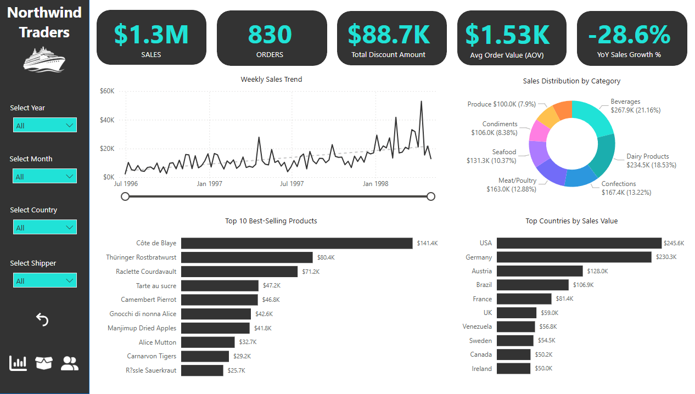
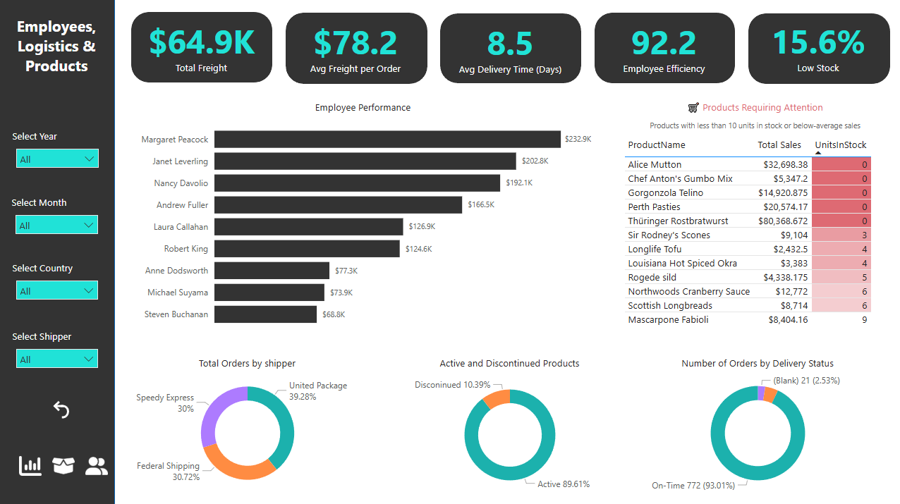

# 📊 Northwind Company Analysis

This project analyzes the **Northwind** database using **SQL Server** and **Power BI**.  
It includes **6 SQL queries** and a **3-page interactive dashboard** focused on **Sales**, **Operations**, and **Customers**.

---

## 📑 Table of Contents

- [🎯 Project Goal](#-project-goal)
- [🧭 Dataset](#-dataset)
- [📊 Power BI Dashboard](#-power-bi-dashboard)
- [📜 SQL Queries](#-sql-queries)
- [🧰 Tools Used](#-tools-used)
- [📸 Screenshots](#-screenshots)
- [💡 Insights](#-insights)

---

## 🧩 Project Overview

**Goal:**  
To analyze the Northwind database through two complementary approaches:
- **SQL Queries:** Used independently to perform business data exploration and demonstrate SQL-based analysis techniques.  
- **Power BI Dashboard:** Designed separately to visualize key metrics for Sales, Operations, and Customers.

**Tools Used:**
- Microsoft SQL Server  
- Power BI Desktop  
- Northwind sample database  

---

## 📑 Dashboard Pages

### 1️⃣ Sales Page
- 🔹 Overview of total revenue, orders, and top-selling products  
- 🔹 Monthly sales trends  

  
🖼️ Click to view screenshot

  
  

---

### 2️⃣ Operations Page
- 🔹 Delivery performance and shipping times  
- 🔹 Inventory and stock status  

  
🖼️ Click to view screenshot

  
  

---

### 3️⃣ Customers Page
- 🔹 Top customers by total purchases  
- 🔹 Customer segmentation by sales value  

  
🖼️ Click to view screenshot

  
  

---

## 💾 SQL Queries

  
<b>🛒 Question1: Expensive_Products_Customers</b>

The marketing team wants to analyze customers who purchased expensive products.

The marketing team wants to identify customers who bought high-priced products for targeted campaigns.  
You've been asked to provide a list with the following information:

1. Customer company name (`CompanyName`)  
2. Number of products purchased with unit price above $30 (`Total Expensive Products`)  
3. Average order value (`Average Order Value`, with 2 decimal places)  

**Filters:**

1. Products should not be discontinued.  
2. The number of products purchased should be more than 3.  

Sort the results by average order value in descending order.

 🔗 [Solution](Queries/Q1_Expensive_Products_Customers.sql)

 🔗 [Output](CSV/Q1_Result_Expensive_Products_Customers.csv)

  
**⭐⭐⭐⭐⭐⭐⭐⭐⭐⭐⭐⭐⭐⭐⭐**  
 

  
<b>🏆 Question2: Rank_Employees_Based_Sales</b>

Rank employees based on their total sales

You've been asked to provide a list with the following information:
 1. Employee's Name(`FirstName` + `LastName`)
 2. Shipper Name (`Shipper company name`)
 3. Year of sale 
 4. Total Sales (with 2 decimal places)
 5. Sales Rank 

 **Filters:**

 Remove invalid records

 Sort the results by year and rank.

 
 🔗 [Solution](Queries/Q2_Rank_Employees_Based_Sales.sql)

 🔗 [Output](CSV/Q2_Result_Rank_Employees_Based_Sales.csv)

 **⭐⭐⭐⭐⭐⭐⭐⭐⭐⭐⭐⭐⭐⭐⭐**

  
<b>📦 Question3: Sales_Performance_Supplier_Within_Category</b>

The Marketing Team wants to analyze the sales performance of suppliers within each product category.

They asked to provide a list with the following information:

1. Category name
2. Supplier name
3. Supplier country
4. Their total revenue(rounded to 2 decimals)
5. Their total quantity sold
6. The average revenue per category (rounded to 2 decimals)

The list should be filtered by the following condition:

The supplier’s total revenue must be greater than the overall average revenue (calculated across all suppliers and categories).

Finally, order the results by total revenue in descending order.

 
 🔗 [Solution](Queries/Q3_Sales_Performance_Supplier_Within_Category.sql)

 🔗 [Output](CSV/Q3_Result_Sales_Performance_Supplier_Within_Category.csv)

 **⭐⭐⭐⭐⭐⭐⭐⭐⭐⭐⭐⭐⭐⭐⭐**

  
<b>🌍 Question4: Sales_Region_Territory_Years</b>

The Management Team wants to analyze sales performance by region and territory over the years 1996-1998.

They asked to provide a report with the following information:

1. Region (`Region Name`)
2. Territory (`Territory Name`)
3. The total sales for each year (1996, 1997, 1998)

The report should be based on the following conditions:

The results should be displayed in a pivot format, with years (1996, 1997, 1998) as separate columns.

Finally, order the results by Region and then by Territory in ascending order.

 
 🔗 [Solution](Queries/Q4_Sales_Region_Territory_Years.sql)

 🔗 [Output](CSV/Q4_Result_Sales_Region_Territory_Years.csv)

 **⭐⭐⭐⭐⭐⭐⭐⭐⭐⭐⭐⭐⭐⭐⭐**

  
<b>🚚 Question5: Delivery_Performance_Shipment_Delays</b>

The Operations Team wants to evaluate delivery performance in terms of shipment delays.

They asked you to provide a report with the following information:

1. Shipper name
2. Employee name
3. Delay category for each order, defined as:

	On Time → when ShippedDate <= RequiredDate

	Minor Delay → when the shipment delay is between 1 and 3 days

	Major Delay → when the shipment delay is greater than 3 days

4. The average delay days (only for orders with an average delay > 0 days)
5. The total number of orders
6. A ranking of employees within each shipper based on their average delay

Finally, order the results by Shipper name and then by delay rank.

 
 🔗 [Solution](Queries/Q5_Delivery_Performance_Shipment_Delays.sql)

 🔗 [Output](CSV/Q5_Result_Delivery_Performance_Shipment_Delays.csv)

 **⭐⭐⭐⭐⭐⭐⭐⭐⭐⭐⭐⭐⭐⭐⭐**

  
<b>📈 Question6: Sales_Across_Multiple_levels_aggregation</b>

The Sales Team wants to analyze sales performance across multiple levels of aggregation. 

They asked you to prepare a report that provides:

1. Total Revenue for each supplier by product category and country.
2. Subtotals for each supplier (across all categories).
3. Subtotals for each country (across all suppliers).
4. A grand total of sales across all suppliers and countries.
5. Additionally, display the overall company revenue on every row for reference.

Finally, order the results by country and then by supplier name.

 
 🔗 [Solution](Queries/Q6_Sales_Across_Multiple_levels_aggregation.sql)

 🔗 [Output](CSV/Q6_Result_Sales_Across_Multiple_levels_aggregation.csv)

 

---

## 🚀 How to Use

1. Restore the **Northwind** database in SQL Server.  
2. Run all SQL queries from the `/SQL_Queries/` folder.  
3. Import the resulting tables into Power BI.  
4. Open `Northwind_Dashboard.pbix` to explore the dashboard.

---

## 🧠 Insights

- Top-performing products and categories  
- On-time delivery rate and shipping efficiency  
- High-value vs. low-value customer segmentation  

---

## 📸 Preview

| Page | Screenshot |
|------|-------------|
| Sales |  |
| Operations |  |
| Customers |  |

---

## 🏷️ Tags
`#SQLServer` `#PowerBI` `#DataAnalysis` `#Northwind` `#Dashboard` `#BusinessIntelligence`

---

👩‍💻 **Author:** Tahereh M.  
📅 *Created in 2025*  

